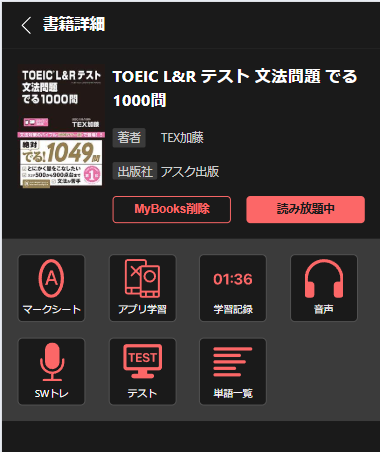

## Preview

|          |               |
| :-------------------------------------------------------------: | :---------------------------------------------------------------------: |
|  |  |

## 技術スタック

- **React**: ユーザーインターフェースの構築に使用。

- **Redux と Redux Toolkit、および Redux Persist**: 状態管理を行い、ページのリロード後もデータを保持。

- **Styled-Components**: CSS-in-JS を用いてユーザーインターフェースをスタイリング。

- **React-Icons**: アプリケーション内でベクターアイコンを使用。

- **Jest**: ユニットテスト。

## How to start

1. `npm install`
2. `npm run dev`

## 確認済みUI環境

- **PC**: Windows → Google Chrome
- **モバイル**: Google Chrome DevTools (iPhone 12 Pro)

---

## パフォーマンス最適化

### フロントエンド

1. **書籍リストの仮想化:**

   - [React Virtualized] または [Vue Virtual Scroller] のようなライブラリを使用し、画面に表示される書籍のみをレンダリングすることでDOMの負荷を軽減します。
   - カバー画像に **遅延読み込み (lazy loading)** を実装し、画面に表示される画像のみを読み込むようにします。

2. **ページネーションまたは無限スクロール:**

   - 書籍をページ単位で分割し、一度に制限されたデータ量のみをロードします。
   - 無限スクロールを実装し、ユーザーがリストの末尾に到達したときに動的にデータをロードします。

3. **クライアント側のキャッシュ:**

   - `RTK Query` || `Vue Apollo` のようなキャッシュライブラリを使用し、すでに取得したデータを保存することで、不要なAPI呼び出しを回避します。

4. **アセットの圧縮:**
   - 画像を圧縮（例: WebPなどの最新フォーマットを使用）し、JavaScriptやCSSファイルを最小化して初期読み込み時間を短縮します。

### バックエンド

1. **サーバー側ページネーション:**

   - ページネーション対応のエンドポイントを実装します（例: `GET /books?page=1&perPage=20`）。これにより、不要なデータをネットワーク経由で送信するのを防ぎます。

2. **データベースのインデックス化:**

   - よく使用されるカラムにインデックスを追加し、検索を高速化します。

3. **サーバー側キャッシュ:**

   - Redisなどのキャッシュを使用し、特に頻繁に使用されるデータ（例: 更新頻度の低いデータ）の取得を高速化します。

4. **コンテンツ配信ネットワーク (CDN):**
   - 書籍の画像やその他の静的アセットをCDNにホストし、レイテンシーを低減します。

---

## MyBook状態のサーバー管理

MyBook登録の状態をサーバー側で管理するための戦略を以下に示します。

### 通信アーキテクチャ

1. **データモデル:**
   MyBook状態を管理する専用テーブルを作成します。

```sql
   CREATE TABLE mybooks (
     user_id INT NOT NULL,
     book_id INT NOT NULL,
     PRIMARY KEY (user_id, book_id),
     FOREIGN KEY (user_id) REFERENCES users(id),
     FOREIGN KEY (book_id) REFERENCES books(id)
   );
GET /mybooks: ユーザーの登録済み書籍リストを取得します。
POST /mybooks: 書籍をMyBooksに追加します。
DELETE /mybooks/:bookId: 書籍をMyBooksから削除します。
```
